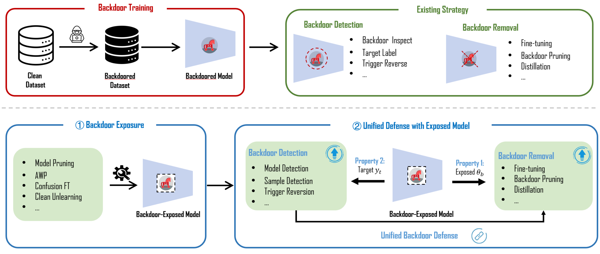

# Expose-Before-You-Defend
A unified backdoor defense: **Expose Before You Defend: Unifying and Enhancing Backdoor Defenses via Exposed Models** by Yige Li, Hanxun Huang, Jiaming Zhang, and Xingjun Ma, Yu-Gang Jiang.

## Introduction

Backdoor attacks covertly implant triggers into deep neural networks (DNNs) by poisoning a small portion of the training data with pre-designed backdoor triggers. This vulnerability is exacerbated in the era of large models, where extensive (pre-)training on web-crawled datasets is susceptible to compromise.
In this paper, we introduce a novel two-step defense framework named \emph{Expose Before You Defend (EBYD)}. EBYD unifies existing backdoor defense methods into a cohesive system with enhanced performance. Specifically, EBYD first exposes the backdoor functionality (features) in the backdoored model through a model preprocessing step called \emph{backdoor exposure}, and then applies detection and removal methods to the exposed model to identify and eliminate the backdoor functionality.
In the first step of backdoor exposure, we propose a novel technique called \textbf{Clean Unlearning (CUL)}, which proactively unlearns clean features from the backdoored model to reveal the hidden backdoor features. We also explore various model editing/modification techniques for backdoor exposure, including fine-tuning, model sparsification, and weight perturbation.

Using EBYD, we conduct extensive experiments on 10 image attacks and 6 text attacks on two vision datasets (CIFAR-10 and an ImageNet subset) and four language datasets (SST-2, IMDB, Twitter, and AG’s News). The results demonstrate the critical role of backdoor exposure in backdoor defense, showing that exposed models can significantly improve backdoor label detection, trigger recovery, backdoor model detection, and backdoor removal.
By incorporating backdoor exposure, our EBYD framework effectively integrates existing backdoor defense methods into a comprehensive and unified defense system. We hope our work opens new avenues for research in backdoor defense focused on the concept of backdoor exposure.

<div align="center">
  
</div>


## Overview of this project
- **attacks:** implementations of backdoor attacks
- **defenses:** implementations of backdoor defenses
- **datasets:** implementation of backdoor exposure techniques
- **datasets:** implementation of wrapper for commonly used dataset based on torchvision
- **models:** implementations for commonly used models
- **training** implementations of training pipeline

## Quick Start
Run the following command to train a backdoored model:

```bash
python backdoor_main.py
```

By default, we only use 500 defense data randomly sampled from the training set to perform the exposure process. To check the performance of backdoor exposure on a Badnets ResNet-18 network (i.e. 10% poisoning rata with ResNet-18 on CIFAR-10), you can directly run the command like:

```bash
python expose_main.py
```

After the backdoor exposure, you can verify the performance of the backdoor detection or removal method listed in their subfolders.

## Acknowledgement
As our work is currently under review, this is an open-source project contributed by the authors. Part of the code is based on our existing paper [RNP](https://github.com/bboylyg/RNP), either as a reimplementation or open-source code.
